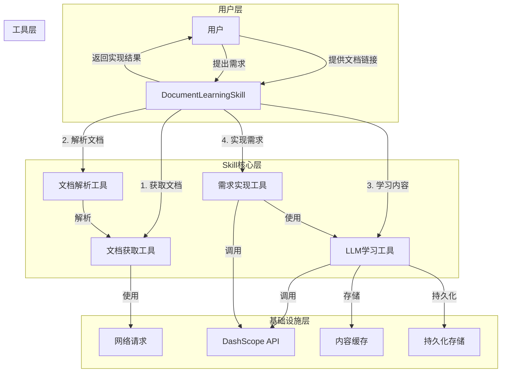
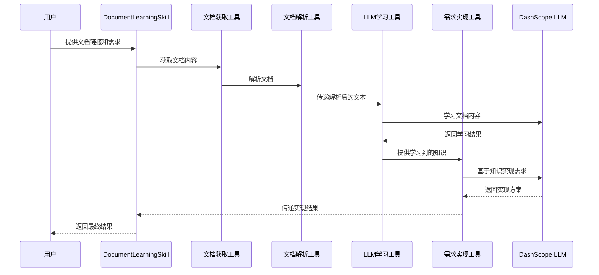

# 文档学习Skill能力实现文档

## 1. 概述

文档学习Skill能力是一个基于LLM的智能技能，允许用户提供多个文档链接，LLM学习这些文档内容后，基于学习到的知识实现用户的需求。

## 2. 技术实现

### 2.1 核心组件

#### 2.1.1 文档获取模块
- **DocumentFetcher**：文档获取接口
- **HtmlFetcher**：HTML文档获取实现
- **PdfFetcher**：PDF文档获取实现
- **OfficeFetcher**：Office文档获取实现
- **CompositeDocumentFetcher**：复合文档获取器，根据URL类型选择合适的获取器

#### 2.1.2 文档解析模块
- **DocumentParser**：文档解析接口
- **HtmlParser**：HTML文档解析实现（使用JSoup）
- **PdfParser**：PDF文档解析实现（使用Apache PDFBox）
- **OfficeParser**：Office文档解析实现（使用Apache POI）
- **CompositeDocumentParser**：复合文档解析器，根据URL类型选择合适的解析器

#### 2.1.3 LLM学习模块
- **LMLearner**：LLM学习接口
- **DashScopeLearner**：DashScope LLM学习实现，使用Spring AI Alibaba的ReactAgent

#### 2.1.4 需求实现模块
- **RequirementExecutor**：需求实现接口
- **DashScopeExecutor**：DashScope需求实现，使用Spring AI Alibaba的ReactAgent

#### 2.1.5 技能管理模块
- **DocumentLearningSkill**：文档学习Skill主类
- **SkillManager**：Skill管理类，用于管理所有的skill实例
- **SkillInitializer**：Skill初始化类，用于在应用启动时初始化和注册skill
- **SkillController**：Skill控制器，用于暴露REST接口

### 2.2 技术栈
- **基础框架**：Spring Boot 3.3.5
- **AI框架**：Spring AI Alibaba 1.1.2.0
- **智能体实现**：ReactAgent
- **LLM提供商**：DashScope (Alibaba Cloud)
- **网络请求**：Spring WebClient
- **文档解析**：JSoup (HTML解析)、Apache PDFBox (PDF解析)、Apache POI (Office文档解析)

## 3. 系统架构



## 4. 数据流程



## 5. 配置与集成

### 5.1 Maven依赖

在pom.xml文件中添加以下依赖：

```xml
<!-- 文档解析依赖 -->
<!-- JSoup for HTML parsing -->
<dependency>
    <groupId>org.jsoup</groupId>
    <artifactId>jsoup</artifactId>
    <version>1.17.2</version>
</dependency>
<!-- Apache PDFBox for PDF parsing -->
<dependency>
    <groupId>org.apache.pdfbox</groupId>
    <artifactId>pdfbox</artifactId>
    <version>3.0.2</version>
</dependency>
<!-- Apache POI for Office document parsing -->
<dependency>
    <groupId>org.apache.poi</groupId>
    <artifactId>poi</artifactId>
    <version>5.2.5</version>
</dependency>
<dependency>
    <groupId>org.apache.poi</groupId>
    <artifactId>poi-ooxml</artifactId>
    <version>5.2.5</version>
</dependency>
<dependency>
    <groupId>org.apache.poi</groupId>
    <artifactId>poi-scratchpad</artifactId>
    <version>5.2.5</version>
</dependency>
```

### 5.2 配置类

创建SkillConfig类，将DocumentLearningSkill注册为Spring Bean：

```java
@Configuration
public class SkillConfig {
    @Bean
    public CompositeDocumentFetcher documentFetcher() {
        return new CompositeDocumentFetcher(
            new HtmlFetcher(),
            new PdfFetcher(),
            new OfficeFetcher()
        );
    }

    @Bean
    public CompositeDocumentParser documentParser() {
        return new CompositeDocumentParser(
            new HtmlParser(),
            new PdfParser(),
            new OfficeParser()
        );
    }

    @Bean
    public LMLearner lmLearner(ReactAgent.Builder reactAgentBuilder) {
        ReactAgent learnerAgent = reactAgentBuilder
            .systemPrompt("你是一个专业的知识学习助手，擅长从文档中提取核心信息并总结。")
            .build();
        return new DashScopeLearner(learnerAgent);
    }

    @Bean
    public RequirementExecutor requirementExecutor(ReactAgent.Builder reactAgentBuilder) {
        ReactAgent executorAgent = reactAgentBuilder
            .systemPrompt("你是一个专业的需求实现助手，擅长基于学习到的知识实现用户的需求。")
            .build();
        return new DashScopeExecutor(executorAgent);
    }

    @Bean
    public DocumentLearningSkill documentLearningSkill(
            CompositeDocumentFetcher documentFetcher,
            CompositeDocumentParser documentParser,
            LMLearner lmLearner,
            RequirementExecutor requirementExecutor) {
        return new DocumentLearningSkill(
            documentFetcher,
            documentParser,
            lmLearner,
            requirementExecutor
        );
    }
}
```

### 5.3 REST接口

创建SkillController类，暴露文档学习skill的REST接口：

```java
@RestController
@RequestMapping("/api/skill")
public class SkillController {
    private final SkillManager skillManager;

    @Autowired
    public SkillController(SkillManager skillManager) {
        this.skillManager = skillManager;
    }

    @PostMapping("/document-learning")
    public ResponseEntity<String> processDocumentLearning(
            @RequestBody DocumentLearningRequest request) {
        try {
            DocumentLearningSkill skill = skillManager.getSkill("documentLearning", DocumentLearningSkill.class);
            String result = skill.processRequest(
                    request.getDocumentUrls(),
                    request.getUserRequirement()
            );
            return ResponseEntity.ok(result);
        } catch (Exception e) {
            return ResponseEntity.badRequest().body("处理失败：" + e.getMessage());
        }
    }
}
```

## 6. 使用示例

### 6.1 REST API调用

```bash
POST /api/skill/document-learning
Content-Type: application/json

{
  "documentUrls": [
    "https://example.com/document1.html",
    "https://example.com/document2.pdf"
  ],
  "userRequirement": "基于这些文档，总结核心内容并提供实施建议"
}
```

### 6.2 代码调用

```java
@Autowired
private SkillManager skillManager;

public String processDocumentLearning() {
    DocumentLearningSkill skill = skillManager.getSkill("documentLearning", DocumentLearningSkill.class);
    List<String> documentUrls = List.of(
        "https://example.com/document1.html",
        "https://example.com/document2.pdf"
    );
    String userRequirement = "基于这些文档，总结核心内容并提供实施建议";
    return skill.processRequest(documentUrls, userRequirement);
}
```

## 7. 性能优化

### 7.1 文档获取优化
- **并发获取**：使用并行流或线程池并发获取多个文档
- **缓存机制**：对已获取的文档进行缓存，避免重复获取
- **超时处理**：设置合理的超时时间，避免单个文档获取阻塞整个流程

### 7.2 文档解析优化
- **增量解析**：对大型文档进行分块解析，避免内存溢出
- **格式优化**：对解析后的内容进行清理和格式化，提高LLM学习效率

### 7.3 LLM学习优化
- **内容摘要**：对长文档进行摘要处理，减少传递给LLM的内容量
- **分批学习**：对多个文档进行分批学习，避免上下文长度限制
- **知识存储**：将学习到的知识进行持久化存储，避免重复学习

## 8. 错误处理

### 8.1 网络错误
- **网络连接失败**：处理网络连接超时、DNS解析失败等问题
- **文档获取失败**：处理404、500等HTTP错误

### 8.2 文档解析错误
- **格式不支持**：处理不支持的文档格式
- **解析失败**：处理文档损坏、格式错误等问题

### 8.3 LLM学习错误
- **上下文长度限制**：处理文档内容过长的问题
- **API调用失败**：处理LLM API调用失败的问题

### 8.4 需求实现错误
- **知识不足**：处理文档中缺少相关信息的情况
- **需求不明确**：处理用户需求模糊的情况

## 9. 安全考虑

### 9.1 URL安全
- **URL验证**：验证用户提供的URL是否安全，避免恶意URL
- **访问控制**：限制文档获取的域名范围，避免访问敏感资源

### 9.2 内容安全
- **内容过滤**：过滤文档中的敏感内容
- **输入验证**：验证用户需求是否合规

### 9.3 API密钥安全
- **密钥管理**：使用.env文件管理API密钥，避免硬编码
- **权限控制**：限制Skill的使用权限，避免滥用

## 10. 未来扩展

### 10.1 功能扩展
- **支持更多文档格式**：添加对更多文档格式的支持
- **知识图谱**：构建知识图谱，提高知识管理能力
- **多语言支持**：添加多语言文档的处理能力

### 10.2 性能优化
- **分布式处理**：使用分布式系统处理大型文档
- **缓存优化**：优化知识缓存策略，提高访问速度
- **模型优化**：使用更适合文档学习的LLM模型

### 10.3 生态集成
- **与其他Skill集成**：与其他Skill能力集成，提供更全面的服务
- **与外部系统集成**：与外部文档管理系统、知识库等集成

## 11. 总结

文档学习Skill能力是一个强大的功能，能够让LLM从用户提供的文档中学习知识，然后基于学习到的知识实现用户的需求。通过合理的架构设计和实现，可以为用户提供更加智能、个性化的服务。

该实现考虑了系统的可扩展性、性能优化、错误处理和安全考虑，为后续的功能扩展和性能优化提供了清晰的指导。通过不断的优化和扩展，可以进一步提升系统的能力和用户体验。