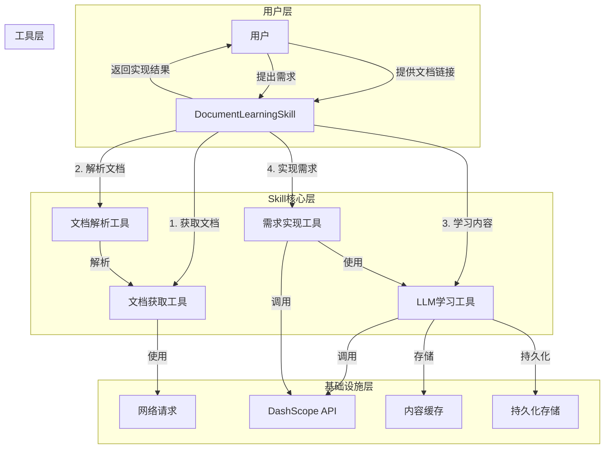
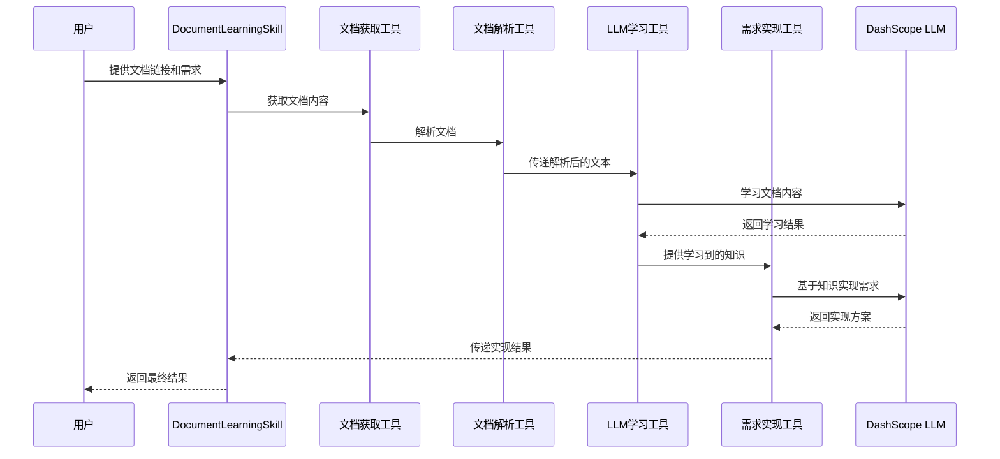

# 文档学习Skill能力设计方案

## 1. 概述

### 1.1 功能目标
设计并实现一个文档学习Skill能力，允许用户提供多个文档链接，LLM学习这些文档内容后，基于学习到的知识实现用户的需求。

### 1.2 技术栈
- **基础框架**：Spring Boot 3.3.5
- **AI框架**：Spring AI Alibaba 1.1.2.0
- **智能体实现**：ReactAgent
- **LLM提供商**：DashScope (Alibaba Cloud)
- **网络请求**：Spring WebClient
- **文档解析**：JSoup (HTML解析)、Apache POI (Office文档解析)
- **内容存储**：内存缓存 + 持久化存储

## 2. 系统架构

### 2.1 整体架构



### 2.2 核心组件

#### 2.2.1 DocumentLearningSkill
- **功能**：作为整个技能的入口点，协调各个组件的工作
- **接口**：`String processRequest(List<String> documentUrls, String userRequirement)`
- **实现**：使用ReactAgent，集成文档学习和需求实现功能

#### 2.2.2 文档获取工具 (DocFetcher)
- **功能**：从用户提供的URL获取文档内容
- **支持格式**：HTML、PDF、Word、Excel等常见文档格式
- **实现**：使用Spring WebClient进行网络请求，支持不同格式文档的获取

#### 2.2.3 文档解析工具 (DocParser)
- **功能**：解析不同格式的文档，提取文本内容
- **实现**：使用JSoup解析HTML，Apache POI解析Office文档

#### 2.2.4 LLM学习工具 (LMLearner)
- **功能**：让LLM学习文档内容，构建知识模型
- **实现**：使用Spring AI Alibaba的ReactAgent，将文档内容作为上下文传递给LLM

#### 2.2.5 需求实现工具 (RequirementExecutor)
- **功能**：基于学习到的知识，实现用户的需求
- **实现**：使用Spring AI Alibaba的ReactAgent，结合学习到的知识和用户需求生成实现方案

## 3. 数据流程



## 4. 实现方案

### 4.1 项目结构

```
src/main/java/com/tlq/rectagent/
├── skill/
│   ├── DocumentLearningSkill.java       # 文档学习Skill主类
│   ├── fetcher/
│   │   ├── DocumentFetcher.java          # 文档获取接口
│   │   ├── HtmlFetcher.java              # HTML文档获取实现
│   │   ├── PdfFetcher.java               # PDF文档获取实现
│   │   └── OfficeFetcher.java            # Office文档获取实现
│   ├── parser/
│   │   ├── DocumentParser.java           # 文档解析接口
│   │   ├── HtmlParser.java               # HTML文档解析实现
│   │   ├── PdfParser.java                # PDF文档解析实现
│   │   └── OfficeParser.java             # Office文档解析实现
│   ├── learner/
│   │   ├── LMLearner.java                # LLM学习接口
│   │   └── DashScopeLearner.java         # DashScope LLM学习实现
│   └── executor/
│       ├── RequirementExecutor.java      # 需求实现接口
│       └── DashScopeExecutor.java        # DashScope需求实现
├── config/
│   └── SkillConfig.java                  # Skill配置类
└── tools/
    └── DocumentTools.java                # 文档处理工具类
```

### 4.2 核心代码设计

#### 4.2.1 DocumentLearningSkill.java

```java
public class DocumentLearningSkill {
    private final DocumentFetcher documentFetcher;
    private final DocumentParser documentParser;
    private final LMLearner lmLearner;
    private final RequirementExecutor requirementExecutor;
    
    // 构造函数注入依赖
    public DocumentLearningSkill(DocumentFetcher documentFetcher, 
                                 DocumentParser documentParser, 
                                 LMLearner lmLearner, 
                                 RequirementExecutor requirementExecutor) {
        this.documentFetcher = documentFetcher;
        this.documentParser = documentParser;
        this.lmLearner = lmLearner;
        this.requirementExecutor = requirementExecutor;
    }
    
    public String processRequest(List<String> documentUrls, String userRequirement) {
        try {
            // 1. 获取并解析文档
            List<String> documentContents = new ArrayList<>();
            for (String url : documentUrls) {
                byte[] content = documentFetcher.fetch(url);
                String parsedContent = documentParser.parse(content, url);
                documentContents.add(parsedContent);
            }
            
            // 2. 让LLM学习文档内容
            String knowledge = lmLearner.learn(documentContents);
            
            // 3. 基于学习到的知识实现需求
            String result = requirementExecutor.execute(knowledge, userRequirement);
            
            return result;
        } catch (Exception e) {
            // 错误处理
            return "处理过程中发生错误：" + e.getMessage();
        }
    }
}
```

#### 4.2.2 LMLearner接口及实现

```java
public interface LMLearner {
    String learn(List<String> documentContents);
}

public class DashScopeLearner implements LMLearner {
    private final ReactAgent learnerAgent;
    
    public DashScopeLearner(ReactAgent learnerAgent) {
        this.learnerAgent = learnerAgent;
    }
    
    @Override
    public String learn(List<String> documentContents) {
        StringBuilder context = new StringBuilder();
        context.append("请学习以下文档内容，以便后续回答相关问题：\n\n");
        
        for (int i = 0; i < documentContents.size(); i++) {
            context.append("文档 " + (i + 1) + "：\n");
            context.append(documentContents.get(i));
            context.append("\n\n");
        }
        
        context.append("请总结这些文档的核心内容，以便后续使用。");
        
        return learnerAgent.invoke(context.toString()).get().toString();
    }
}
```

#### 4.2.3 RequirementExecutor接口及实现

```java
public interface RequirementExecutor {
    String execute(String knowledge, String userRequirement);
}

public class DashScopeExecutor implements RequirementExecutor {
    private final ReactAgent executorAgent;
    
    public DashScopeExecutor(ReactAgent executorAgent) {
        this.executorAgent = executorAgent;
    }
    
    @Override
    public String execute(String knowledge, String userRequirement) {
        StringBuilder context = new StringBuilder();
        context.append("基于以下学习到的知识，实现用户的需求：\n\n");
        context.append("学习到的知识：\n");
        context.append(knowledge);
        context.append("\n\n用户需求：\n");
        context.append(userRequirement);
        context.append("\n\n请基于学习到的知识，详细实现用户的需求。");
        
        return executorAgent.invoke(context.toString()).get().toString();
    }
}
```

### 4.3 配置方案

#### 4.3.1 Skill配置类

```java
@Configuration
public class SkillConfig {
    @Bean
    public DocumentFetcher documentFetcher() {
        return new CompositeDocumentFetcher(
            new HtmlFetcher(),
            new PdfFetcher(),
            new OfficeFetcher()
        );
    }
    
    @Bean
    public DocumentParser documentParser() {
        return new CompositeDocumentParser(
            new HtmlParser(),
            new PdfParser(),
            new OfficeParser()
        );
    }
    
    @Bean
    public LMLearner lmLearner(ReactAgent.Builder reactAgentBuilder) {
        ReactAgent learnerAgent = reactAgentBuilder
            .systemPrompt("你是一个专业的知识学习助手，擅长从文档中提取核心信息并总结。")
            .build();
        return new DashScopeLearner(learnerAgent);
    }
    
    @Bean
    public RequirementExecutor requirementExecutor(ReactAgent.Builder reactAgentBuilder) {
        ReactAgent executorAgent = reactAgentBuilder
            .systemPrompt("你是一个专业的需求实现助手，擅长基于学习到的知识实现用户的需求。")
            .build();
        return new DashScopeExecutor(executorAgent);
    }
    
    @Bean
    public DocumentLearningSkill documentLearningSkill(
            DocumentFetcher documentFetcher,
            DocumentParser documentParser,
            LMLearner lmLearner,
            RequirementExecutor requirementExecutor) {
        return new DocumentLearningSkill(
            documentFetcher,
            documentParser,
            lmLearner,
            requirementExecutor
        );
    }
}
```

### 4.4 集成方案

#### 4.4.1 与现有多智能体系统集成

```java
// 在CoordinatorAgent中集成DocumentLearningSkill
public class CoordinatorAgent {
    private final DocumentLearningSkill documentLearningSkill;
    
    // 构造函数注入
    public CoordinatorAgent(DocumentLearningSkill documentLearningSkill) {
        this.documentLearningSkill = documentLearningSkill;
    }
    
    public String processDocumentLearningRequest(List<String> documentUrls, String userRequirement) {
        return documentLearningSkill.processRequest(documentUrls, userRequirement);
    }
}
```

#### 4.4.2 暴露为REST接口

```java
@RestController
@RequestMapping("/api/skill")
public class SkillController {
    private final DocumentLearningSkill documentLearningSkill;
    
    // 构造函数注入
    public SkillController(DocumentLearningSkill documentLearningSkill) {
        this.documentLearningSkill = documentLearningSkill;
    }
    
    @PostMapping("/document-learning")
    public ResponseEntity<String> processDocumentLearning(
            @RequestBody DocumentLearningRequest request) {
        String result = documentLearningSkill.processRequest(
            request.getDocumentUrls(),
            request.getUserRequirement()
        );
        return ResponseEntity.ok(result);
    }
}

public class DocumentLearningRequest {
    private List<String> documentUrls;
    private String userRequirement;
    
    // getters and setters
}
```

## 5. 性能优化

### 5.1 文档获取优化
- **并发获取**：使用并行流或线程池并发获取多个文档
- **缓存机制**：对已获取的文档进行缓存，避免重复获取
- **超时处理**：设置合理的超时时间，避免单个文档获取阻塞整个流程

### 5.2 文档解析优化
- **增量解析**：对大型文档进行分块解析，避免内存溢出
- **格式优化**：对解析后的内容进行清理和格式化，提高LLM学习效率

### 5.3 LLM学习优化
- **内容摘要**：对长文档进行摘要处理，减少传递给LLM的内容量
- **分批学习**：对多个文档进行分批学习，避免上下文长度限制
- **知识存储**：将学习到的知识进行持久化存储，避免重复学习

## 6. 错误处理

### 6.1 网络错误
- **网络连接失败**：处理网络连接超时、DNS解析失败等问题
- **文档获取失败**：处理404、500等HTTP错误

### 6.2 文档解析错误
- **格式不支持**：处理不支持的文档格式
- **解析失败**：处理文档损坏、格式错误等问题

### 6.3 LLM学习错误
- **上下文长度限制**：处理文档内容过长的问题
- **API调用失败**：处理LLM API调用失败的问题

### 6.4 需求实现错误
- **知识不足**：处理文档中缺少相关信息的情况
- **需求不明确**：处理用户需求模糊的情况

## 7. 安全考虑

### 7.1 URL安全
- **URL验证**：验证用户提供的URL是否安全，避免恶意URL
- **访问控制**：限制文档获取的域名范围，避免访问敏感资源

### 7.2 内容安全
- **内容过滤**：过滤文档中的敏感内容
- **输入验证**：验证用户需求是否合规

### 7.3 API密钥安全
- **密钥管理**：使用.env文件管理API密钥，避免硬编码
- **权限控制**：限制Skill的使用权限，避免滥用

## 8. 测试策略

### 8.1 单元测试
- **文档获取测试**：测试不同格式文档的获取功能
- **文档解析测试**：测试不同格式文档的解析功能
- **LLM学习测试**：测试LLM学习文档内容的能力
- **需求实现测试**：测试基于学习到的知识实现需求的能力

### 8.2 集成测试
- **完整流程测试**：测试从文档获取到需求实现的完整流程
- **错误处理测试**：测试各种错误情况的处理
- **性能测试**：测试系统的响应速度和处理能力

### 8.3 验收测试
- **功能验收**：验证系统是否满足需求
- **性能验收**：验证系统的性能是否达到预期
- **安全验收**：验证系统的安全性是否符合要求

## 9. 部署与集成

### 9.1 依赖管理
- **添加必要依赖**：JSoup、Apache POI等
- **版本控制**：确保依赖版本与现有项目兼容

### 9.2 配置管理
- **环境变量**：使用.env文件管理API密钥和配置信息
- **配置文件**：在application.yml中添加Skill相关配置

### 9.3 集成到现有系统
- **服务注册**：将DocumentLearningSkill注册为Spring Bean
- **API集成**：通过REST接口暴露Skill功能
- **智能体集成**：将Skill集成到现有的多智能体系统中

## 10. 未来扩展

### 10.1 功能扩展
- **支持更多文档格式**：添加对更多文档格式的支持
- **知识图谱**：构建知识图谱，提高知识管理能力
- **多语言支持**：添加多语言文档的处理能力

### 10.2 性能优化
- **分布式处理**：使用分布式系统处理大型文档
- **缓存优化**：优化知识缓存策略，提高访问速度
- **模型优化**：使用更适合文档学习的LLM模型

### 10.3 生态集成
- **与其他Skill集成**：与其他Skill能力集成，提供更全面的服务
- **与外部系统集成**：与外部文档管理系统、知识库等集成

## 11. 结论

文档学习Skill能力是一个强大的功能，能够让LLM从用户提供的文档中学习知识，然后基于学习到的知识实现用户的需求。通过合理的架构设计和实现，可以为用户提供更加智能、个性化的服务。

该设计方案考虑了系统的可扩展性、性能优化、错误处理和安全考虑，为后续的实现提供了清晰的指导。通过不断的优化和扩展，可以进一步提升系统的能力和用户体验。