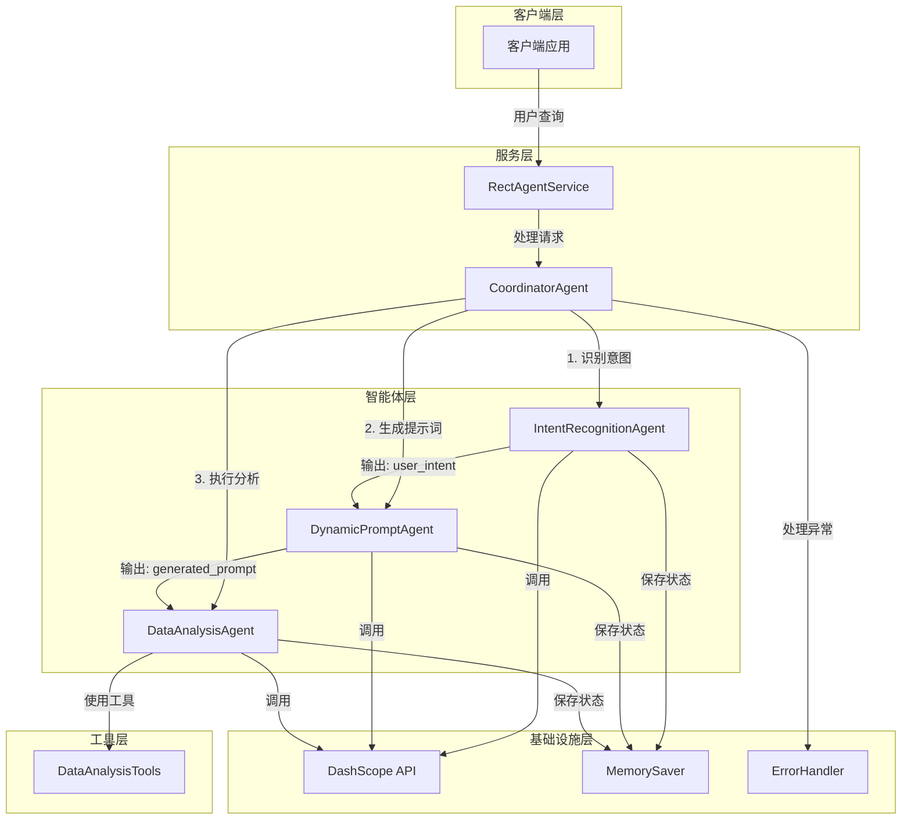
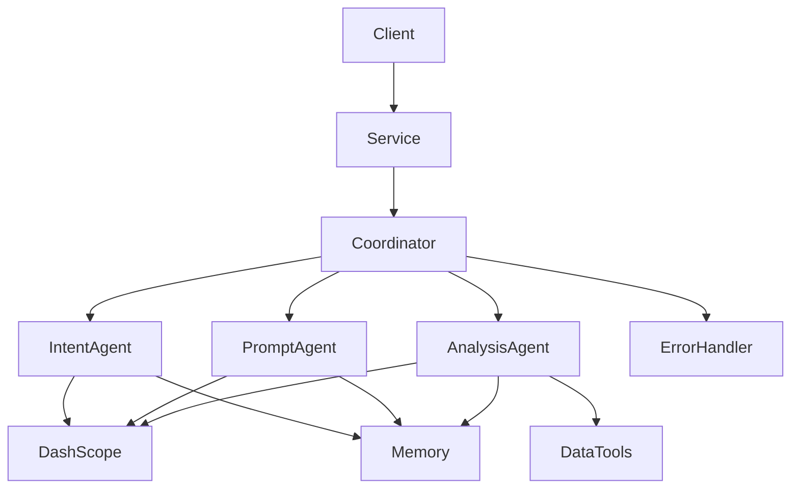
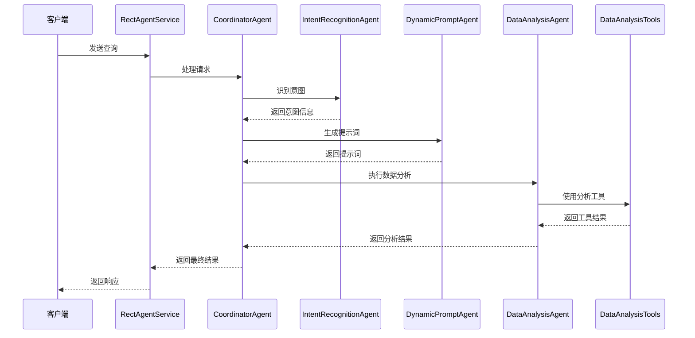

# DESIGN: 基于Instruction占位符的多智能体编排系统

## 整体架构图

## 分层设计和核心组件

### 1. 客户端层
- **客户端应用**：用户交互界面，发送查询请求

### 2. 服务层
- **RectAgentService**：对外提供服务接口，接收用户请求
- **CoordinatorAgent**：协调智能体执行顺序，管理数据传递

### 3. 智能体层
- **IntentRecognitionAgent**：识别用户查询意图
- **DynamicPromptAgent**：根据意图生成优化的提示词
- **DataAnalysisAgent**：执行数据分析任务

### 4. 工具层
- **DataAnalysisTools**：提供数据分析相关工具

### 5. 基础设施层
- **DashScope API**：提供LLM服务
- **MemorySaver**：保存智能体状态
- **ErrorHandler**：处理异常情况

## 模块依赖关系图

## 接口契约定义

### 1. IntentRecognitionAgent
- **输入**：用户查询字符串
- **输出**：结构化的用户意图信息（JSON格式）
- **接口**：`String recognizeIntent(String userInput)`

### 2. DynamicPromptAgent
- **输入**：用户意图 + 上下文信息
- **输出**：优化的提示词
- **接口**：`String generatePrompt(String intent, String context)`

### 3. DataAnalysisAgent
- **输入**：优化的提示词
- **输出**：数据分析结果
- **接口**：`String analyzeData(String query)`

### 4. CoordinatorAgent
- **输入**：用户查询字符串
- **输出**：最终的数据分析结果
- **接口**：`String processRequest(String userInput)`

### 5. RectAgentService
- **输入**：用户查询字符串
- **输出**：服务响应
- **接口**：`String processUserQuery(String userQuery)`

## 数据流向图

## 异常处理策略

### 1. 智能体执行异常
- **捕获GraphRunnerException**：处理智能体执行过程中的异常
- **日志记录**：记录异常详细信息
- **降级处理**：返回友好的错误信息给用户

### 2. API调用异常
- **网络异常**：处理网络连接问题
- **API限流**：处理API调用频率限制
- **认证异常**：处理API密钥错误

### 3. 数据传递异常
- **数据格式错误**：确保数据格式正确
- **数据丢失**：实现数据传递的可靠性
- **数据验证**：验证传递的数据有效性

### 4. 系统级异常
- **资源耗尽**：处理内存、CPU等资源问题
- **配置错误**：处理配置文件错误
- **依赖服务不可用**：处理依赖服务故障

## 设计原则

1. **模块化**：各智能体独立封装，职责明确
2. **可扩展性**：易于添加新的智能体和工具
3. **可靠性**：完善的错误处理和容错机制
4. **可维护性**：清晰的代码结构和文档
5. **性能优化**：智能体实例缓存，减少重复创建

## 关键设计决策

1. **使用手动顺序执行**：由于Spring AI Alibaba 1.1.2.0可能未提供SequentialAgent，采用手动顺序执行方式
2. **Instruction占位符传递**：利用ReactAgent的instruction占位符和outputKey实现智能体间数据传递
3. **内存管理**：使用MemorySaver保存智能体状态，确保数据连续性
4. **错误处理**：实现全面的异常捕获和处理机制
5. **性能优化**：智能体实例缓存，减少重复创建开销