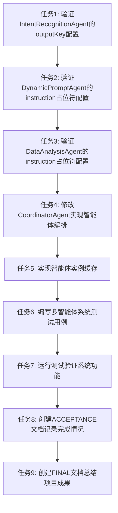

# TASK: 基于Instruction占位符的多智能体编排系统

## 子任务拆分

### 任务1: 验证IntentRecognitionAgent的outputKey配置

**输入契约**：
- 现有IntentRecognitionAgent代码
- Spring AI Alibaba 1.1.2.0 API文档

**输出契约**：
- 确认IntentRecognitionAgent正确配置了outputKey("user_intent")
- 验证智能体能够正常生成意图信息

**实现约束**：
- 保持现有代码结构
- 确保与Spring AI Alibaba 1.1.2.0兼容

**依赖关系**：
- 无前置依赖
- 后置任务：任务2

### 任务2: 验证DynamicPromptAgent的instruction占位符配置

**输入契约**：
- 现有DynamicPromptAgent代码
- IntentRecognitionAgent的输出格式

**输出契约**：
- 确认DynamicPromptAgent正确配置了instruction("用户意图：{user_intent}\n请根据用户意图生成一个优化的提示词。")
- 确认配置了outputKey("generated_prompt")
- 验证智能体能够使用占位符接收意图信息

**实现约束**：
- 保持现有代码结构
- 确保与Spring AI Alibaba 1.1.2.0兼容

**依赖关系**：
- 前置任务：任务1
- 后置任务：任务3

### 任务3: 验证DataAnalysisAgent的instruction占位符配置

**输入契约**：
- 现有DataAnalysisAgent代码
- DynamicPromptAgent的输出格式

**输出契约**：
- 确认DataAnalysisAgent正确配置了instruction("提示词：{generated_prompt}\n请根据提示词执行数据分析任务。")
- 验证智能体能够使用占位符接收提示词信息

**实现约束**：
- 保持现有代码结构
- 确保与Spring AI Alibaba 1.1.2.0兼容

**依赖关系**：
- 前置任务：任务2
- 后置任务：任务4

### 任务4: 修改CoordinatorAgent实现智能体编排

**输入契约**：
- 现有CoordinatorAgent代码
- 三个智能体的接口定义

**输出契约**：
- 实现智能体的顺序执行：IntentRecognitionAgent → DynamicPromptAgent → DataAnalysisAgent
- 确保数据正确传递
- 添加错误处理和日志记录

**实现约束**：
- 使用手动顺序执行方式
- 保持代码简洁可读
- 添加适当的异常处理

**依赖关系**：
- 前置任务：任务3
- 后置任务：任务5

### 任务5: 实现智能体实例缓存

**输入契约**：
- 现有智能体代码
- Spring依赖注入机制

**输出契约**：
- 为每个智能体实现实例缓存
- 减少重复创建智能体的开销
- 确保缓存的智能体能够正确工作

**实现约束**：
- 使用Spring的单例模式或缓存机制
- 确保线程安全

**依赖关系**：
- 前置任务：任务4
- 后置任务：任务6

### 任务6: 编写多智能体系统测试用例

**输入契约**：
- 实现完成的多智能体系统
- 测试框架配置

**输出契约**：
- 编写单元测试用例
- 编写集成测试用例
- 验证系统的完整流程

**实现约束**：
- 覆盖正常流程、边界条件和异常情况
- 使用JUnit或Spring Test框架

**依赖关系**：
- 前置任务：任务5
- 后置任务：任务7

### 任务7: 运行测试验证系统功能

**输入契约**：
- 编写完成的测试用例
- 实现完成的多智能体系统

**输出契约**：
- 所有测试通过
- 系统能够正常处理用户请求
- 智能体间数据传递正确

**实现约束**：
- 运行完整的测试套件
- 验证系统的性能和可靠性

**依赖关系**：
- 前置任务：任务6
- 后置任务：任务8

### 任务8: 创建ACCEPTANCE文档记录完成情况

**输入契约**：
- 测试结果
- 系统实现状态

**输出契约**：
- 详细记录每个任务的完成情况
- 验证系统是否满足验收标准
- 记录任何问题和解决方案

**实现约束**：
- 详细、准确的记录
- 与验收标准对应

**依赖关系**：
- 前置任务：任务7
- 后置任务：任务9

### 任务9: 创建FINAL文档总结项目成果

**输入契约**：
- 所有任务的完成情况
- 系统实现细节

**输出契约**：
- 项目总结报告
- 技术实现方案
- 系统架构和组件
- 测试结果
- 未来改进建议

**实现约束**：
- 全面、准确的总结
- 清晰的文档结构

**依赖关系**：
- 前置任务：任务8
- 无后置任务

## 任务依赖图

## 拆分原则

1. **原子性**：每个任务都是最小的、可独立执行的单元
2. **可测试性**：每个任务都有明确的验收标准
3. **依赖清晰**：任务间依赖关系明确，避免循环依赖
4. **复杂度可控**：每个任务的复杂度适中，便于实现和测试
5. **功能完整**：所有任务组合起来能够实现完整的多智能体编排系统

## 实现顺序

按照任务依赖图的顺序执行，确保每个任务的前置条件都已满足。优先执行高优先级任务，确保核心功能的实现。