# Vibe Coding 实战文章：基于多智能体系统的实践与沉淀

## 1. Vibe Coding 概念与重要性

### 1.1 什么是 Vibe Coding

Vibe Coding 是一种强调结构化、文档化和持续改进的编码实践方法论。它不仅仅是一种编码风格，更是一种思维方式和工作流程，旨在提高开发效率、代码质量和团队协作。

### 1.2 Vibe Coding 的核心价值

- **结构化思维**：通过结构化的方式分析问题和设计解决方案
- **知识沉淀**：通过文档化记录设计决策和实现细节
- **持续改进**：通过不断调整和优化技能和规则，提高开发质量
- **团队协作**：通过标准化的流程和文档，促进团队成员之间的理解和协作

## 2. Vibe Coding 实践要素

### 2.1 提问结构化

#### 2.1.1 问题分析框架
- **背景理解**：首先分析项目的技术栈、架构和现有代码
- **需求拆解**：将复杂需求拆分为可执行的子任务
- **技术选型**：基于现有架构和约束选择合适的技术方案
- **实现路径**：制定清晰的实现步骤和依赖关系

#### 2.1.2 示例问题结构
```
[背景] 现有项目是基于Spring AI Alibaba实现的智能体系统
[需求] 实现基于Instruction占位符的多智能体编排
[技术约束] 使用Spring AI Alibaba 1.1.2.0，ReactAgent
[实现目标] 实现智能体间的数据传递和顺序执行
```

### 2.2 每次 coding 文档化

#### 2.2.1 文档结构
- **ALIGNMENT文档**：项目上下文分析和需求理解确认
- **CONSENSUS文档**：技术实现方案和验收标准
- **DESIGN文档**：系统架构和组件设计
- **TASK文档**：任务拆分和实现顺序
- **ACCEPTANCE文档**：任务完成情况和验收标准验证
- **FINAL文档**：项目总结报告和未来改进建议

#### 2.2.2 文档化实践
- **实时记录**：在编码过程中实时记录设计决策和实现细节
- **版本控制**：使用Git进行代码和文档的版本管理
- **知识沉淀**：通过文档沉淀项目经验和技术方案

### 2.3 任务结束后的 Skill 和 Rule 调整

#### 2.3.1 Skill 调整
- **智能体编排Skill**：优化SequentialAgent的使用，提高智能体协作效率
- **数据传递Skill**：改进Instruction占位符的使用，确保数据正确传递
- **性能优化Skill**：实现智能体实例缓存，减少重复创建的开销
- **错误处理Skill**：增强异常处理机制，提高系统稳定性

#### 2.3.2 Rule 调整
- **编码规范Rule**：统一代码风格和命名规范
- **测试规范Rule**：建立完善的测试用例和测试流程
- **文档规范Rule**：制定统一的文档结构和格式
- **安全规范Rule**：加强API密钥管理和权限控制

## 3. 多智能体实践问答与Vibe Coding应用

### 3.1 智能体编排实现问答

#### 3.1.1 问题：如何实现基于Instruction占位符的多智能体编排？

**背景**：需要实现基于Instruction占位符的多智能体编排系统，确保智能体间的数据正确传递。

**Vibe Coding 应用**：
- **提问结构化**：分析需求，拆解为智能体配置、编排、性能优化和错误处理四个子任务
- **文档化**：创建DESIGN文档，记录智能体编排的架构设计
- **Skill调整**：优化SequentialAgent的使用，实现智能体实例缓存

**实现方案**：
1. **智能体配置**：为每个智能体配置正确的outputKey和instruction占位符
2. **智能体编排**：使用Spring AI Alibaba的SequentialAgent实现智能体的顺序执行
3. **性能优化**：为每个智能体实现实例缓存，减少重复创建的开销
4. **错误处理**：添加全面的异常处理机制，确保系统的稳定性

**核心代码**：

```java
// CoordinatorAgent.java 中的核心实现
private List<Agent> createAgentList() {
    List<Agent> agents = new ArrayList<>();
    agents.add(intentRecognitionAgent.getAgent());
    agents.add(dynamicPromptAgent.getAgent());
    agents.add(dataAnalysisAgent.getAgent());
    return agents;
}

public String processRequest(String userInput) {
    try {
        List<Agent> agents = createAgentList();
        SequentialAgent sequentialAgent = SequentialAgent.builder()
                .subAgents(agents)
                .build();
        String result = sequentialAgent.invoke(userInput).get().toString();
        log.info("多智能体执行结果: {}", result);
        return result;
    } catch (Exception e) {
        log.error("多智能体执行异常: {}", e.getMessage(), e);
        return "执行过程中发生错误，请稍后重试。";
    }
}
```

### 3.2 数据传递机制问答

#### 3.2.1 问题：如何实现智能体间的数据传递？

**背景**：需要实现智能体间的数据传递，确保意图信息从IntentRecognitionAgent传递到DynamicPromptAgent，提示词从DynamicPromptAgent传递到DataAnalysisAgent。

**Vibe Coding 应用**：
- **提问结构化**：分析数据传递的需求，确定每个智能体的输入和输出
- **文档化**：在DESIGN文档中记录数据传递机制的设计
- **Skill调整**：改进Instruction占位符的使用，确保数据正确传递

**实现方案**：
1. **IntentRecognitionAgent**：设置outputKey("user_intent")
2. **DynamicPromptAgent**：使用{user_intent}占位符接收意图信息，设置outputKey("generated_prompt")
3. **DataAnalysisAgent**：使用{generated_prompt}占位符接收提示词信息

**配置示例**：

```java
// IntentRecognitionAgent 配置
ReactAgent intentAgent = ReactAgent.builder()
        .systemPrompt("你是一个专业的意图识别专家，擅长分析用户查询的意图。")
        .outputKey("user_intent")
        .build();

// DynamicPromptAgent 配置
ReactAgent promptAgent = ReactAgent.builder()
        .systemPrompt("你是一个专业的提示词工程师，擅长根据用户意图生成优化的提示词。")
        .instruction("用户意图：{user_intent}\n请根据用户意图生成一个优化的提示词。")
        .outputKey("generated_prompt")
        .build();

// DataAnalysisAgent 配置
ReactAgent analysisAgent = ReactAgent.builder()
        .systemPrompt("你是一位资深的数据安全分析专家，擅长从数据中发现安全隐患和异常。")
        .instruction("提示词：{generated_prompt}\n请根据提示词执行数据分析任务。")
        .build();
```

### 3.3 性能优化问答

#### 3.3.1 问题：如何优化智能体系统的性能？

**背景**：智能体系统在处理大量请求时性能下降，需要优化系统性能。

**Vibe Coding 应用**：
- **提问结构化**：分析性能瓶颈，确定优化方向
- **文档化**：在FINAL文档中记录性能优化的方案和效果
- **Skill调整**：实现智能体实例缓存，减少重复创建的开销

**实现方案**：
1. **智能体实例缓存**：为每个智能体实现实例缓存，避免重复创建
2. **并发处理**：使用多线程处理并发请求
3. **资源管理**：合理管理系统资源，避免资源泄露

## 4. 项目背景与技术栈

### 4.1 项目概述
基于Spring AI Alibaba 1.1.2.0实现的多智能体系统，用于数据分析业务。系统通过多个智能体的协作，实现了用户查询意图识别、动态提示词生成和数据分析的完整流程。

### 4.2 技术栈
- **基础框架**：Spring Boot 3.3.5
- **AI框架**：Spring AI Alibaba 1.1.2.0
- **智能体实现**：ReactAgent
- **LLM提供商**：DashScope (Alibaba Cloud)
- **编程语言**：Java 21

### 4.3 系统架构

```mermaid
flowchart TD
    subgraph 客户端层
        Client[客户端应用]
    end

    subgraph 服务层
        Service[RectAgentService]
        Coordinator[CoordinatorAgent]
    end

    subgraph 智能体层
        IntentAgent[IntentRecognitionAgent]
        PromptAgent[DynamicPromptAgent]
        AnalysisAgent[DataAnalysisAgent]
    end

    subgraph 工具层
        DataTools[DataAnalysisTools]
    end

    subgraph 基础设施层
        DashScope[DashScope API]
        Memory[MemorySaver]
        ErrorHandler[ErrorHandler]
    end

    Client -->|用户查询| Service
    Service -->|处理请求| Coordinator
    Coordinator -->|1. 识别意图| IntentAgent
    Coordinator -->|2. 生成提示词| PromptAgent
    Coordinator -->|3. 执行分析| AnalysisAgent
    IntentAgent -->|输出: user_intent| PromptAgent
    PromptAgent -->|输出: generated_prompt| AnalysisAgent
    AnalysisAgent -->|使用工具| DataTools
    IntentAgent -->|调用| DashScope
    PromptAgent -->|调用| DashScope
    AnalysisAgent -->|调用| DashScope
    IntentAgent -->|保存状态| Memory
    PromptAgent -->|保存状态| Memory
    AnalysisAgent -->|保存状态| Memory
    Coordinator -->|处理异常| ErrorHandler
```



## 5. 实践总结与收获

### 5.1 技术收获
- **多智能体协作**：成功实现了基于Instruction占位符的多智能体编排系统
- **数据传递机制**：掌握了使用outputKey和instruction占位符实现智能体间数据传递的方法
- **性能优化**：实现了智能体实例缓存，减少了重复创建的开销
- **错误处理**：建立了全面的异常处理机制，提高了系统的稳定性

### 5.2 实践沉淀
- **文档化流程**：建立了完整的文档体系，包括ALIGNMENT、CONSENSUS、DESIGN、TASK、ACCEPTANCE和FINAL文档
- **编码规范**：制定了统一的代码风格和命名规范，提高了代码的可维护性
- **测试策略**：编写了完整的测试用例，确保系统的可靠性
- **知识共享**：通过文档和代码注释，实现了知识的沉淀和共享

### 5.3 Vibe Coding 实践心得
- **结构化思维**：通过结构化的问题分析，提高了问题解决的效率和质量
- **文档化习惯**：通过持续的文档化，减少了沟通成本，提高了团队协作效率
- **持续改进**：通过不断调整和优化技能和规则，提高了开发质量和效率
- **实践验证**：通过多智能体系统的实践，验证了Vibe Coding的有效性和价值

### 5.4 未来展望
- **智能体编排优化**：探索使用更高级的智能体编排机制，提高系统的灵活性和可扩展性
- **功能扩展**：添加更多智能体和工具，满足更复杂的业务需求
- **性能优化**：进一步优化系统性能，提高响应速度和并发处理能力
- **安全性增强**：加强系统的安全性，保护敏感数据和API密钥

## 6. 结论

Vibe Coding 实践在多智能体系统项目中发挥了重要作用，通过结构化的提问、文档化的编码过程和持续的Skill/Rule调整，我们成功实现了一个功能完整、架构清晰的多智能体系统。

该系统不仅满足了业务需求，还为未来的智能体系统开发提供了宝贵的实践经验和技术沉淀。通过Vibe Coding的实践，我们建立了一套完整的开发流程和规范，为团队的技术成长和项目的持续迭代奠定了坚实的基础。

Vibe Coding 不仅仅是一种编码实践，更是一种思维方式和工作态度。通过不断实践和改进，我们可以提高开发效率、代码质量和团队协作，为项目的成功交付保驾护航。